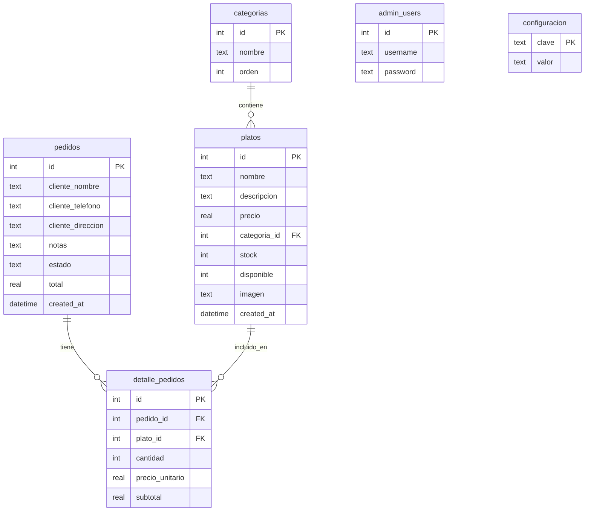

# Contexto del Proyecto: Restaurante Betty 🍽️

Este documento sirve como referencia completa del estado del sistema de **Restaurante Betty**, su arquitectura, base de datos, funcionalidades implementadas y el avance actual del proyecto para facilitar el desarrollo futuro.

---

## 📌 1. Descripción General
**Restaurante Betty** es una aplicación web interactiva de página única (SPA) diseñada para gestionar la carta de un restaurante, permitir a los clientes realizar pedidos en tiempo real y brindar a los administradores un panel de control completo para gestionar el stock, las categorías de platos, los pedidos entrantes y la configuración general del restaurante.

---

## 🛠️ 2. Arquitectura y Stack Tecnológico

El proyecto está construido bajo una arquitectura cliente-servidor monolítica ligera:

### Backend (Servidor)
- **Entorno de Ejecución:** Node.js (versión 18+)
- **Framework Web:** Express (v5.2.1)
- **Base de Datos:** SQLite (mediante la librería de alto rendimiento `better-sqlite3` v12.8.0)
- **Comunicación Bidireccional:** Socket.io (v4.8.3) para sincronización en tiempo real.
- **Seguridad / Encriptación:** Bcrypt (v6.0.0) para el cifrado de contraseñas de administrador.

### Frontend (Cliente y Admin)
- **Estructura y Semántica:** HTML5 con iconos de FontAwesome (v6.5.1).
- **Tipografías:** Google Fonts (Playfair Display para títulos elegantes, Inter/Lato para legibilidad de cuerpo).
- **Estilos:** CSS3 nativo avanzado (con variables CSS, flexbox, grid, animaciones de transición y diseño responsivo).
- **Interactividad:** Vanilla JavaScript interactuando con las APIs REST de Express y eventos websocket de Socket.io.
- **Imágenes:** Carga dinámica usando imágenes por defecto asociadas a categorías y URLs de Unsplash basadas en el nombre del plato.

---

## 📁 3. Estructura de Directorios

```text
restaurante/
├── database.js            # Inicialización de SQLite, definición de tablas y datos semilla (Seed)
├── server.js              # Servidor principal Express y sockets (Socket.io), APIs REST de negocio
├── restaurante.db         # Archivo de base de datos SQLite (generado automáticamente al iniciar)
├── package.json           # Dependencias de Node.js y scripts de inicio (start, dev)
├── INSTRUCCIONES.txt      # Guía rápida de instalación y credenciales para el usuario
└── public/                # Archivos estáticos del frontend
    ├── index.html         # Interfaz pública para clientes (Visualización del menú y carrito)
    ├── admin.html         # Panel de administración (Dashboard, Pedidos, Platos, Ajustes)
    ├── css/
    │   ├── style.css      # Estilos premium para la tienda del cliente
    │   └── admin.css      # Estilos premium de panel administrativo con temática oscura/clara
    └── js/
        ├── app.js         # Lógica del cliente, carrito, pedidos e integración con Socket.io
        └── admin.js       # Lógica del panel, autenticación por Token, CRUD de datos y Socket.io
```

---

## 🗄️ 4. Modelo de Datos (Base de Datos)

La base de datos SQLite consta de 6 tablas principales con integridad referencial activa:



### Detalle de las Tablas
1. **`categorias`**: Permite organizar los platos. Campos: `id`, `nombre` (Único), `orden`.
2. **`platos`**: Almacena el menú. Campos: `id`, `nombre`, `descripcion`, `precio`, `categoria_id` (FK), `stock`, `disponible` (booleano), `imagen` (URL opcional), `created_at`.
3. **`pedidos`**: Registra los pedidos del cliente. Campos: `id`, `cliente_nombre`, `cliente_telefono`, `cliente_direccion`, `notas`, `estado` (valores: `'pendiente'`, `'en_preparacion'`, `'completado'`, `'cancelado'`), `total`, `created_at`.
4. **`detalle_pedidos`**: Tabla de rompimiento para los platos asociados a cada pedido. Campos: `id`, `pedido_id` (FK), `plato_id` (FK), `cantidad`, `precio_unitario`, `subtotal`.
5. **`admin_users`**: Usuarios autorizados. Cuenta inicial: `admin` / `admin123` (encriptada con bcrypt).
6. **`configuracion`**: Almacena valores dinámicos clave-valor del negocio (ej. `nombre_restaurante`, `direccion`, `telefono`, `horario`, `mensaje_bienvenida`, `precio_menu_normal`).

---

## 🚀 5. Funcionalidades Implementadas

### 🛒 Interfaz del Cliente (`index.html` / `app.js`)
- **Visualización Dinámica:** Carga de categorías y platos directamente desde la base de datos con un diseño elegante y moderno.
- **Filtros por Categoría:** Sistema dinámico para filtrar platos por sección o ver "Todos".
- **Gestión de Stock Visual:** Muestra badges dinámicos si un plato está por agotarse (stock ≤ 5) o si ya está "Agotado" (deshabilitando su botón de compra).
- **Carrito de Compras Incorporado:** Panel lateral deslizable que permite agregar, sustraer y recalcular totales de platos seleccionados al instante.
- **Creación de Pedidos:** Formulario emergente (Modal) para capturar el nombre del cliente, teléfono, dirección y notas.
- **Sincronización en Tiempo Real:** Actualizaciones instantáneas del stock y disponibilidad en la carta mediante Websockets cuando se realizan compras o el administrador modifica stock.

### 🛡️ Panel del Administrador (`admin.html` / `admin.js`)
- **Autenticación Segura:** Acceso protegido por login con encriptación bcrypt, gestionado mediante sesiones de token efímeras en el servidor y `localStorage` en el cliente.
- **Dashboard de Estadísticas:** Panel central con métricas dinámicas de:
  - Platos Activos.
  - Platos Agotados.
  - Pedidos Recibidos Hoy.
  - Pedidos en estado Pendiente.
  - Ganancias Totales del Día.
  - Lista de alertas de Stock Bajo (≤ 5 unidades).
  - Feed en tiempo real de Pedidos Recientes.
- **Módulo de Pedidos:** Tabla o flujo de tarjetas que permite filtrar por estados y cambiar el flujo del pedido:
  - *Pendiente* ➡️ *En Preparación* o *Cancelar*.
  - *En Preparación* ➡️ *Completar*.
- **Módulo de Platos (CRUD):**
  - Creación, edición y eliminación de platos.
  - Carga/Edición de URLs de imágenes personalizadas.
  - Control de stock rápido directamente desde la tabla con botones `+` y `-`.
- **Módulo de Categorías:**
  - Agregar nuevas categorías asignándoles un orden visual.
  - Validación en cascada (no se permite borrar categorías que posean platos activos).
- **Configuración del Sistema:**
  - Formulario integrado para editar datos del restaurante (Nombre, Dirección, Teléfono, Horario, Mensaje de bienvenida, Precios generales) con impacto inmediato en el sitio del cliente gracias a los WebSockets.

---

## 📈 6. Resumen de Credenciales y Pruebas
- **Página de Cliente:** `http://localhost:3000`
- **Panel Admin:** `http://localhost:3000/admin`
  - **Usuario:** `admin`
  - **Contraseña:** `admin123`

---

## 🔮 7. Próximos Ajustes y Mejoras Sugeridas ("Arreglos")
Para consolidar la solidez del sistema, se proponen las siguientes mejoras que definiremos a continuación:
1. **Validaciones en los formularios:** Asegurar que los inputs numéricos (precios, stock) no acepten valores negativos en el cliente ni en el servidor.
2. **Campos Opcionales vs Requeridos:** Añadir validación al teléfono y dirección del cliente si el tipo de pedido es "Delivery" (actualmente son de texto abierto opcionales).
3. **Formateo e Impresión de Tickets:** Permitir al administrador abrir un ticket de pedido amigable para impresión física directa.
4. **Mejora en la gestión de imágenes:** Permitir subir archivos de imagen reales o asociar una lista preestablecida de fotos locales para evitar depender exclusivamente de URLs externas de Unsplash.
5. **Historial de Ventas / Reportes:** Un gráfico visual de ventas semanales o mensuales en el Dashboard.
